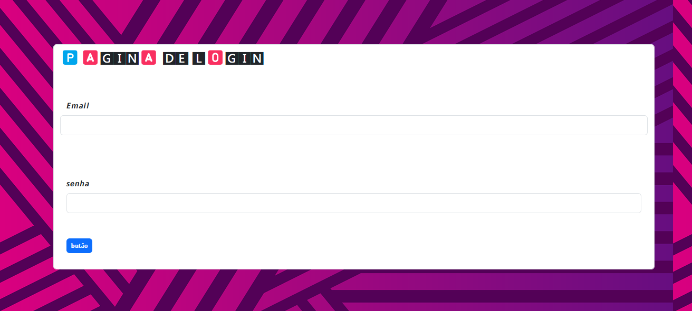

# tela de login 

* [repositotios](#repositorios-comsultados)
* [descrição](#destrição)
* [introdução ](#introdução)
* [tecnologias utilizadas](#tecnologias_utilizadas)
* [fontes consultadas](#fontes_consultadas)
* [autores](#autores)

# destrição
### este projeto tem 3 campos e tem a finalidade de testar uma tela de login

# introdução 
###  este projeto tem 3 campos com campo de nome,senha e um botão funsional que esta sem link de navegação 

# tecnologias utilizadas
###  botstrap,css 3,html 5,

### fontes consultadas

* https://pixabay.com/pt/

* https://getbootstrap.com/

## repositorios comsultados 

* https://github.com/leoOliveiraBR/login

* https://github.com/EmillyBonfim/for-login

* https://github.com/luan18alencar/form-Login

# autores
###  felipe da silva gonçalves

# ferramentas utilizadas 
### botstrap,css 3,html 5,

# turma:1° c 
### disiplina FTW 

# sites utilizados 

*  https://pixabay.com/pt/

*  https://getbootstrap.com/

